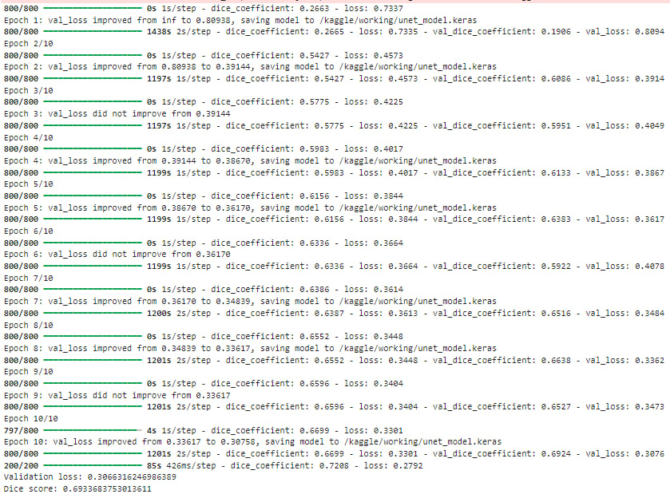
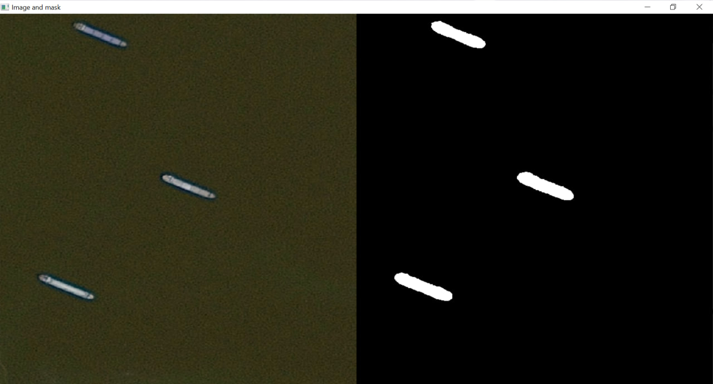
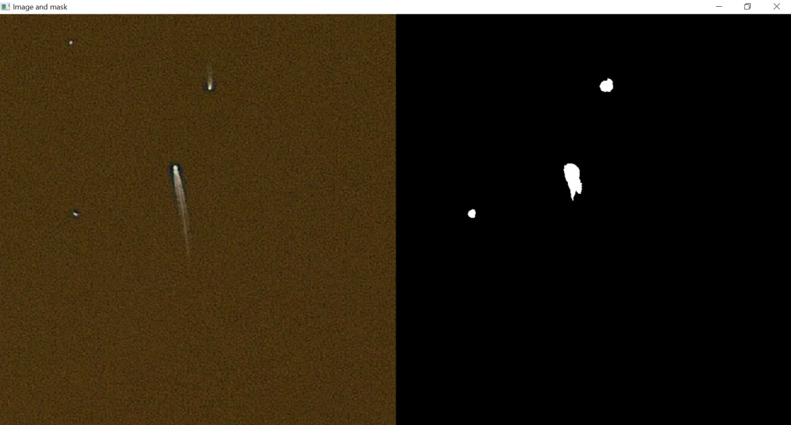
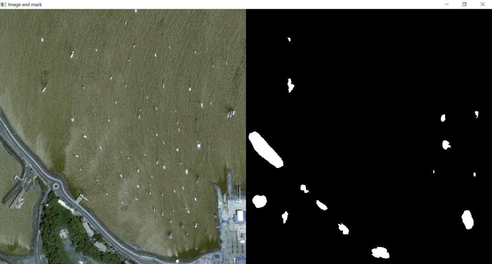
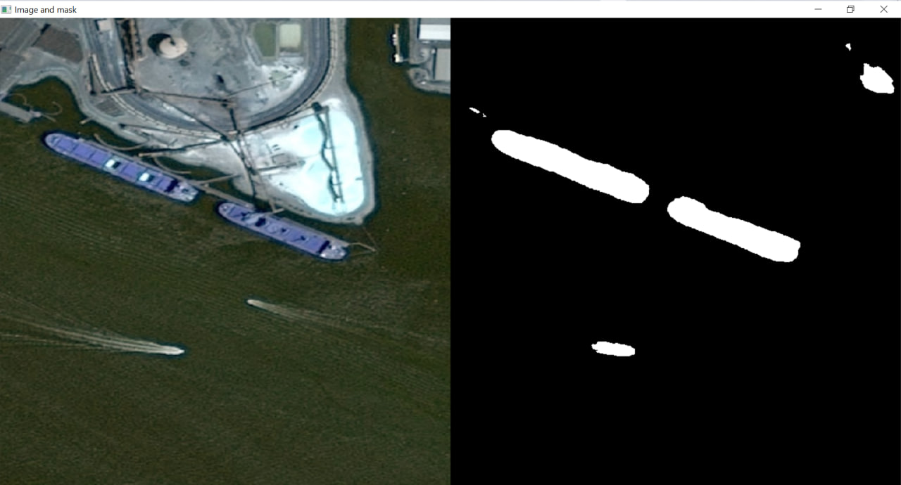

# Semantic segmentation using U-net for Airbus Ship Detection

## Overview
The project was created to recognize ships in images (semantic segmentation) using U-net model, tf.keras, dice loss. [The dataset from the kaggle website](https://www.kaggle.com/c/airbus-ship-detection) was used for implementation.

## Steps:
1. Data analysis (size of images, analyze the ship distribution, ship area distribution, visualizing images and masks)
2. Group df rows by ID, combine masks of ships.
3. Calculate the area of ships on images.
4. Create datasets (undersampling: the number of images with and without ships are specified in the file, images with ships are selected with a weighting factor of the area of these ships).
5. Build U-net model.
6. Define custom objects: dice loss and dice coefficient.
7. Define optimizer, loss function, other metrics, early stopping, model checkpoint.
8. Define augmentation function.
8. Training the model.
9. Final evaluating the model.
11. Create other files: testing for images, testing for dataframe.

## Structure of project
```
├── dataset_info.py            # Configuration file for selecting images and defining column names for ship detection.
├── image_config.py            # Image configuration parameters: number of channels, height, and width.
├── model_hyperparameters.py   # Training parameters: batch size, number of epochs, random state number, learning rate, patience, and verbosity.
├── paths.py                   # Paths for training images, test images, CSV files, model files, test image, and output file.
├── README.md                  # Contains an overview of the project, steps involved, project structure, installation instructions, and usage guidelines.
├── requirements.txt           # Specifies the necessary Python libraries and dependencies required for the project.
├── test_unet_dataframe.py     # Test the U-Net Model for dataframe and save the results to .csv file.
├── test_unet_for_image.py     # Test the U-Net model on a specific image and visualize the results.
├── train_unet.py              # Train the U-Net Model with specified hyperparameters
├── unet_model.keras           # Trained U-net Model: 4000 images with ships, 4000 images without ships, val%=0.2, epochs=10, batch_size=8.
├── data-analysis.ipynb        # A Jupyter Notebook used for comprehensive exploratory data analysis (EDA) on the dataset, focusing on ship distribution and dataset characteristics.
```
## Installation

### Prerequisites
- Python 3.6 or higher
- pip (Python package installer)

### Install Dependencies
To install the necessary dependencies, run:
```bash
pip install -r requirements.txt
```
## Usage guideline
### Step 1: Train the U-Net Model
To train the U-net Model, use:
```bash
python train_unet.py
```
You can specify paths to train.csv, train and test image folders, path to model in **paths.py** </br>
You can specify the model hyperparameters in **model_hyperparameters.py** </br>
You can specify the image size in **image_config.py** </br>
You can specify column names, numbers of images with ships/without ships in **dataset_info.py**

### Step 2: Test the U-Net Model for image
To test the U-Net model on a specific image and visualize the results:
```bash
python test_unet_for_image.py
```
You can define test picture in **paths.py**

### Step 3: Test the U-Net Model for dataframe
To record an encoded mask for each image in the dataframe, use:
```bash
python test_unet_dataframe.py
```
You can specify the path to input and output .csv file in **paths.py**

## Results
### Model training

### Vizualized predictions





## Notes
To achieve better results, you need to increase the number of images for training, make the model more complex (for this, you need to use a better GPU), and find the optimal batch size, number of epochs, patience, and learning rate for the new architecture.